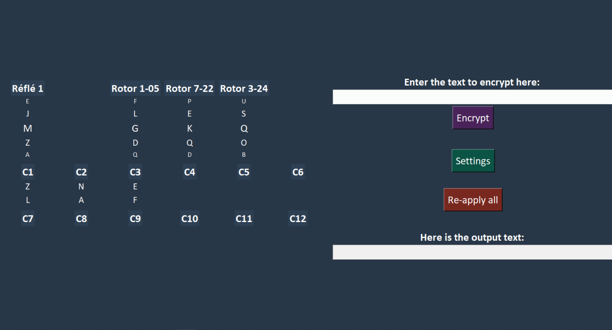

# Enigma simulator - 2021 / 2022

## Table of contents
1. [General Information](#general-info)
2. [Technologies](#technologies)
3. [Files Organisation](#organisation)
4. [How to use](#how-to-use)

***
<a name="general-info"></a>
## General Informations

This project is a school project. The goal is to create a program that can encrypt and decrypt a message like the Enigma machine did. The program must be able to encrypt and decrypt a message using the following parameters:

- The message to encrypt or decrypt,
- The choice of rotors,
- The position of the rotors,
- The choice of reflector,
- The number of plugboards,
- The position of the plugboards.

The parameters can be entered manually or by using a QR code. And all the display of the program must be done using [tkinter](https://docs.python.org/3/library/tkinter.html).

The main screen will able the user to see the current state of the machine, the message to encrypt or decrypt, the current position of the rotors, the current position of the reflector and the current position of the plugboards.

The option screen will allow the user to choose the different parameters of the Enigma machine. It will also allow the user to choose if he wants to enter the parameters manually or by using a QR code.

***
<a name="technologies"></a>
## Technologies

A list of technologies used within the project:
* [Python](https://www.python.org/): Version 3.9.1
* [tkinter](https://docs.python.org/3/library/tkinter.html): Version 8.6
* [string](https://docs.python.org/3/library/string.html): Version 3.9.1
* [os](https://docs.python.org/3/library/os.html): Version 3.9.1
* [random](https://docs.python.org/3/library/random.html): Version 3.9.1
* [ast](https://docs.python.org/3/library/ast.html): Version 3.9.1
* [pyzbar](https://pypi.org/project/pyzbar/): Version 0.1.8
* [Pillow](https://pypi.org/project/Pillow/): Version 8.1.0
* [qrcode](https://pypi.org/project/qrcode/): Version 6.1

***
<a name="organisation"></a>
## Files Organisation

The project is organised as follow:
```
├── main.py
├── files
│   ├── EnigmComputAuto.py
│   ├── EnigmFonctionAuto.py
│   └── EnigmInputAuto.py
├── images
│   └──  enigma.ico
├── QRcode
│   ├── QRCparametre.png
╵   └── QRCparametre1.png
```

### [```main.py```](/main.py)
This file is the main file of the project. It contains the main loop of the program. It also contains the function that allows to create the window of the program, it will call the other files to create the different windows of the program and compute the encryption or decryption of the message.
#

### [```EnigmComputAuto.py```](/EnigmComputAuto.py)
This file contains the function that will compute the encryption or decryption of the message step by step.
#

### [```EnigmFonctionAuto.py```](/EnigmFonctionAuto.py)
This file contains the different functions that will be used in the program, mostly used for the display of the different parts of the program.
#

### [```EnigmInputAuto.py```](/EnigmInputAuto.py)
This file contains the function that will allow the user to enter the different parameters of the Enigma machine, manually or by using a QR code. It will also check if the parameters entered are valid.
#

### [```enigma.ico```](/enigma.ico)
This file is the icon to be used by [tkinter](https://docs.python.org/3/library/tkinter.html) to display the icon of the program.
#

### [```QRcode```](/QRcode/)
This folder contains the QR codes that can be used to enter the parameters of the Enigma machine. There is already two exemples of QR code provided in the folder.

***
<a name="how-to-use"></a>
## How to use

### Main screen
The main screen of the program look like this:


The different parts of the screen are:

- In the left panel :
    - The current position of the reflector,
    - The current position of the three rotors,
    - The current position of the plugboards.
- In the right panel :
    - The message to encrypt or decrypt,
    - The button to encrypt or decrypt the message,
    - The button to go to the option screen,
    - The button to apply again the last parameters entered,
    - The encrypted or decrypted message.

#
### Option screen
The option screen of the program look like this:


The different parts of the screen are:

- The two top button :
    - The button to randomize the parameters,
    - The button to enter the parameters with a QR code.
- The four parameters :
    - The choice of the letters linked by the plugboards,
    - The choice of the rotors,
    - The choice of the position of the rotors,
    - The choice of the reflector.
- The three bottom button :
    - The button to go back to the main screen,
    - The button to save the parameters as a QR code,
    - The button to apply the parameters.

#
### Use step by step

1. Go to the option screen and choose the parameters of the machine if you want to.

2. Enter the message to encrypt in the main screen.

3. Click on the button to encrypt the message.

4. The encrypted message will appear in the right part of the screen.

5. If you want to decrypt the message, enter the encrypted message in the right part of the screen (you should copy the encrypted message).

6. Click on the button to apply the last parameters entered.

7. Click on the button to decrypt the message.

8. The decrypted message will appear in the right part of the screen again.
